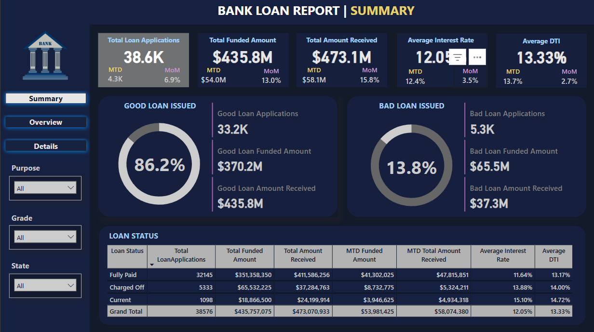
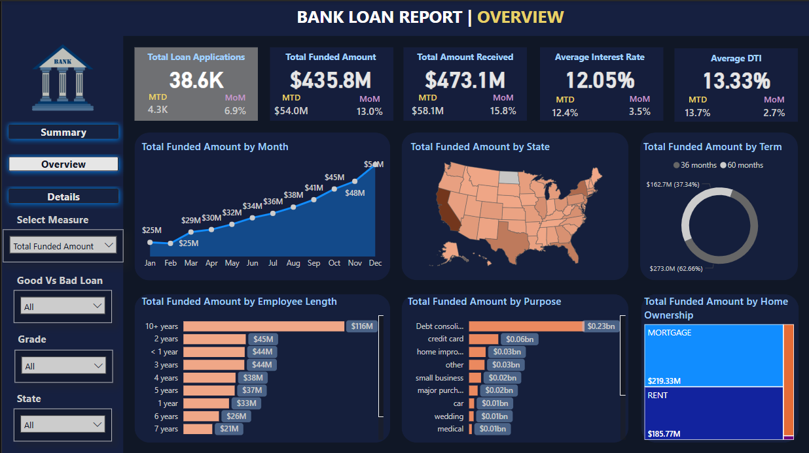
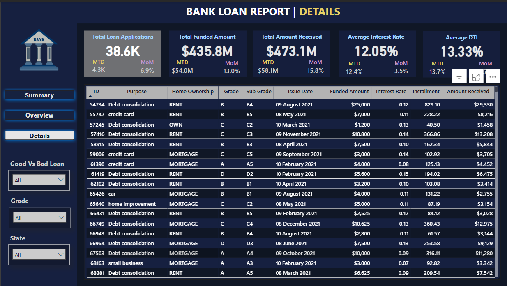

# 🏦 Bank Loan Analysis Project

## 📚 Project Overview
This project involves developing a comprehensive Bank Loan Analysis Dashboard using Power BI connected to an MS SQL Server database. The aim is to explore, analyse, and visualize loan-related data to drive strategic financial decisions and provide insights into loan issuance, repayment, and borrower behaviour.

________________________________________
## ❗ Problem Statement
Financial institutions require a dynamic and insightful view of their loan portfolio to track performance, minimize risks, and improve decision-making. The objectives include:
-	Tracking loan applications, funded amounts, and repayments.
-	Measuring Average Interest Rates and Debt-to-Income (DTI) ratios.
-	Classifying loans as Good vs. Bad and monitoring loan status.
-	Understanding regional, demographic, and purpose-based lending trends.

________________________________________
## 📊 Key Visuals in the Power BI Dashboard
### 💼 Summary
- KPIs: Total Loan Applications, Funded Amount, Received Amount, Interest Rate, and DTI.
-	Good Loan vs Bad Loan Issuance (Pie Charts).
-	Loan Status Table: Fully Paid, Charged Off, Current
- 

### 🔎 Overview
- Funded Amount by Month (Line Chart).
-	Regional Loan Distribution (Filled Map).
-	Loan Term Breakdown (Donut Chart).
-	Funded Amount by Employee Length, Loan Purpose, and Home Ownership (Bar and Tree Maps).
- 

### 📈 Detailed
Detailed insights are derived by examining each record with filters and slicers. These allow users to interact with specific borrower profiles and compare them against macro trends.
- 

________________________________________
## 💡 Key Insights
-	**`86.2%`** of issued loans are classified as Good, while **`13.8%`** are Bad.
-	Loans for Debt Consolidation represent the highest funded purpose **`$0.23B`**.
-	Most loans are for 60 months **`62.66%`**.
-	Highest funded employment length: 10+ years **`$116M`**.
-	Homeowners with Mortgages received more funding **`$219M`** compared to renters.

________________________________________
## 🛠️ Tools and Technologies
-	MS SQL Server
-	SQL Server Management Studio
-	Power BI 
-	MS Excel 2021
  
________________________________________
## 🗄️ Database Structure
The dataset includes fields such as:
- `id`
- `address_state`
- `application_type`
- `emp_length`
- `emp_title`
- `grade`
- `home_ownership`
- `issue_date`
- `last_credit_pull_date`
- `last_payment_date`
- `loan_status`
- `next_payment_date`
- `member_id`
- `purpose`
- `sub_grade`
- `term`
- `verification_status`
- `annual_income`
- `dti`
- `installment`
- `int_rate`
- `loan_amount`
- `total_acc`
- `total_payment`

________________________________________
## ⚙️ Key Features
-	Dynamic filtering by State, Grade, Purpose
-	MoM and MTD tracking of all key metrics
-	Good vs Bad Loan segmentation
-	Region-wise and purpose-wise loan disbursal analysis
-	Employment and Home Ownership breakdowns

________________________________________
## 🚀 How to Run the Project
1.	Import SQL data into MS SQL Server.
2.	Open Power BI and connect to the database.
3.	Use Power Query to clean and transform the data.
4.	Build relationships and data model.
5.	Load visuals and configure filters and KPIs.
   
________________________________________
## 📄 Access Full Documentation
👉  Dataset [link](./Dataset/financial_loan.csv)

________________________________________
## 🙌 Acknowledgments
Special thanks to:
-	Open Source SQL and Power BI Communities
-	Microsoft Power Platform
-	Data analysts and financial experts who inspired the metrics

